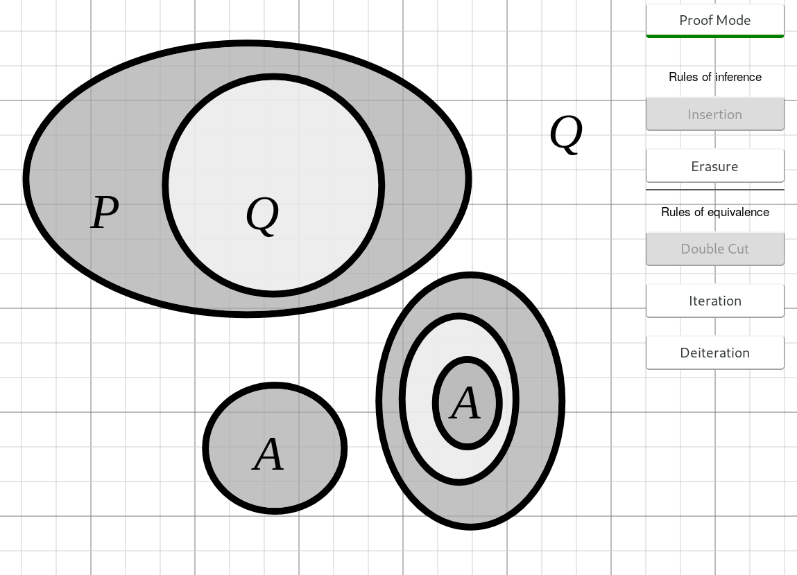

# Visual Logic


### About

<p align="center">
	
</p>

Visual Logic is a tool for formal logic by manipulating [Existential Graphs](https://en.wikipedia.org/wiki/Existential_graph).

*Read more about using it under the [wiki](https://github.com/shailpatels/VisualLogic-Web/wiki/Instructions)*


### Development

Start by cloning the project, installing dependencies and then run the 
page locally.

Dependencies are managed by `npm`, currently the following packages are used:

- [Jest](https://jestjs.io/) - used for testing
- [serve](https://www.npmjs.com/package/serve) - used to run a local development server
- [esm](https://www.npmjs.com/package/esm) - used to allow Jest to run with ES6 syntax
- [eslint](https://eslint.org/) - used for linting 

**Installing dependencies**. From the root directory of the project run the command:

```bash
npm install
```

**Viewing the application locally**

```bash
npx serve
```

The above command will start a local server, copy the URL the project is locally hosted at and view the application in a web browser.

### Testing

Run 
```bash
npm test
```

To run the test suite and generate coverage
*Note: some of the coverage may 
be highlighted incorrectly due to `esm` being used to allow jest to test ES6 JS modules.*

Individual files can be run by:

```bash
npm test -- tests/foo.test.js
```

The linter can be run with the command:

```bash
npm run lint
```

Some errors can be fixed automatically by eslint by running the command

```bash
npm run lint:fix
```
